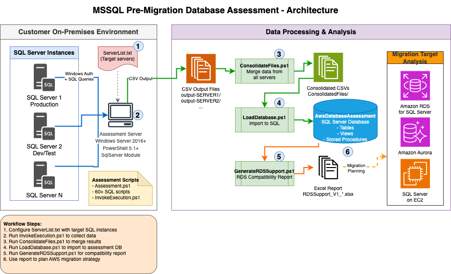

# MSSQL Pre-Migration Database Assessment

PowerShell/SQL toolkit that executes pre-migration assessments on SQL Server environments, collecting metadata to inform AWS RDS/Aurora migration planning.

## Features

## Architecture



The assessment follows a three-step workflow:

1. **Data Collection** – Assessment scripts execute against SQL Server instances, collecting metadata about databases, configurations, and workloads
2. **Data Processing** – CSV outputs are consolidated and loaded into an assessment database for analysis
3. **Report Generation** – Reports are generated to support migration planning to AWS RDS, Aurora, or EC2

## What Data Is Collected

The assessment collects metadata at both database and server levels:

**Database Level:**
- General information (name, collation, compatibility level, recovery model, isolation level)
- CLR assemblies and direct references to other databases
- Filestream and InMemory configurations
- I/O and CPU utilization metrics
- SSIS packages (SSISDB and MSDB) including environment settings
- SSRS reports and subscriptions
- User permissions and securables
- Table inventory, tables without primary keys
- Replication publisher information
- Database audit specifications
- Extended stored procedures (including xp_cmdshell usage)

**Server Level:**
- Backup execution statistics and sp_configure settings
- CPU utilization from SQL processes
- Connected hosts and custom error messages
- Database mail configuration and deprecated features
- Instance information (collation, version, edition, build, install/reboot times)
- Hardware details (CPU count, memory, OS architecture, virtual/physical)
- Linked servers, logins, and server-level permissions
- Database mirroring, Service Broker, and proxy agent configurations
- SQL Agent jobs, alerts, and operators
- Trace flags, disk volume latency, and storage sizing

## Prerequisites

- Windows Server 2016+ with network access to target SQL Server instances
- PowerShell 5.1+
- SqlServer PowerShell module (automatically installed if missing)
- Windows domain account with assessment permissions (see [Permissions](#permissions))
- SQL Server 2016+ on target instances (for TLS encryption support)

## Quick Start

```powershell
# 1. Set environment variable
$Env:DB_ASSESSMENT_HOME = 'C:\DatabaseAssessment'

# 2. Navigate to the assessment folder
cd $Env:DB_ASSESSMENT_HOME\DatabaseAssessment

# 3. Edit ServerList.txt with your SQL Server instances
# Example entries:
#   SRVDB001
#   SRVDB002\SQL2016
#   SRVDB003.corp.sql.com\SQL2017

# 4. Run assessment against all servers
.\InvokeExecution.ps1

# 5. Consolidate data from all instances
.\ConsolidateFiles.ps1

# 6. Load into assessment database (auto-creates if needed)
.\LoadDatabase.ps1 -SqlInstance "YOURSERVER" -DatabaseName "AwsDatabaseAssessment"

# 7. Generate reports
.\GenerateAppQuestionnaire.ps1 -SqlInstance "YOURSERVER" -OutputPath "C:\Reports"
.\GenerateRDSSupport.ps1 -SqlInstance "YOURSERVER" -OutputPath "C:\Reports"
```

## Architecture


The assessment follows a three-step workflow:

1. **Data Collection** – Assessment scripts execute against SQL Server instances, collecting metadata about databases, configurations, and workloads
2. **Data Processing** – CSV outputs are consolidated and loaded into an assessment database for analysis
3. **Report Generation** – Reports are generated to support migration planning to AWS RDS, Aurora, or EC2

## What Data Is Collected

The assessment collects metadata at both database and server levels:

**Database Level:**
- General information (name, collation, compatibility level, recovery model, isolation level)
- CLR assemblies and direct references to other databases
- Filestream and In-Memory OLTP configurations
- I/O and CPU utilization metrics
- SSIS packages (SSISDB and MSDB) including environment settings
- SSRS reports and subscriptions
- User permissions and securables
- Table inventory, tables without primary keys
- Replication publisher information
- Database audit specifications
- Extended stored procedures (including xp_cmdshell usage)

**Server Level:**
- Backup execution statistics and sp_configure settings
- CPU utilization from SQL processes
- Connected hosts and custom error messages
- Database mail configuration and deprecated features
- Instance information (collation, version, edition, build, install/reboot times)
- Hardware details (CPU count, memory, OS architecture, virtual/physical)
- Linked servers, logins, and server-level permissions
- Database mirroring, Service Broker, and proxy agent configurations
- SQL Agent jobs, alerts, and operators
- Trace flags, disk volume latency, and storage sizing

## Permissions

The assessment requires elevated SQL Server permissions. The following table explains each permission and why it is needed:

| Permission | Required For | Risk if Abused | Can Be Scoped Down? |
|---|---|---|---|
| `VIEW ANY DEFINITION` | Reading object definitions across all databases | Object source code exposure | No - server-level only |
| `VIEW SERVER STATE` | DMV access for performance metrics and configuration | Server state visibility | No - server-level only |
| `ALTER ANY SERVER AUDIT` | Reading server audit specifications | Could create/modify/drop audits | Consider `VIEW ANY SERVER AUDIT` (SQL 2022+) |
| `VIEW ANY DATABASE` | Listing all databases and their properties | Database metadata visibility | No - required for comprehensive assessment |
| `xp_regenumkeys` | Enumerating SQL Server services via registry | Registry key enumeration | Skip if service inventory not needed |
| `xp_regread` | Reading SQL Server configuration from registry | Registry value access | Skip if registry-based config not needed |
| `db_datareader` (all DBs) | Reading system catalog views in each database | Could read application data | Limit to system catalogs if custom role acceptable |
| `ssis_admin` (SSISDB only) | Reading SSIS package metadata | SSIS project visibility | Only required if SSISDB exists |

**Security recommendations:**
- Use a dedicated service account for assessments
- Grant permissions only for the assessment duration
- Revoke permissions immediately after completion

For grant/revoke scripts and detailed guidance, see [docs/permissions.md](docs/permissions.md).

The assessment requires elevated SQL Server permissions. The following table explains each permission and why it is needed:

| Permission | Required For | Risk if Abused | Can Be Scoped Down? |
|---|---|---|---|
| `VIEW ANY DEFINITION` | Reading object definitions across all databases | Object source code exposure | No - server-level only |
| `VIEW SERVER STATE` | DMV access for performance metrics and configuration | Server state visibility | No - server-level only |
| `ALTER ANY SERVER AUDIT` | Reading server audit specifications | Could create/modify/drop audits | Consider `VIEW ANY SERVER AUDIT` (SQL 2022+) |
| `VIEW ANY DATABASE` | Listing all databases and their properties | Database metadata visibility | No - required for comprehensive assessment |
| `xp_regenumkeys` | Enumerating SQL Server services via registry | Registry key enumeration | Skip if service inventory not needed |
| `xp_regread` | Reading SQL Server configuration from registry | Registry value access | Skip if registry-based config not needed |
| `db_datareader` (all DBs) | Reading system catalog views in each database | Could read application data | Limit to system catalogs if custom role acceptable |
| `ssis_admin` (SSISDB only) | Reading SSIS package metadata | SSIS project visibility | Only required if SSISDB exists |

**Security recommendations:**
- Use a dedicated service account for assessments
- Grant permissions only for the assessment duration
- Revoke permissions immediately after completion

For grant/revoke scripts and detailed guidance, see [docs/permissions.md](docs/permissions.md).

## Script Reference

| Script | Description | Parameters |
|--------|-------------|------------|
| `InvokeExecution.ps1` | Collects data from SQL Server instances | None (uses ServerList.txt) |
| `ConsolidateFiles.ps1` | Merges CSV files from all instances | None |
| `LoadDatabase.ps1` | Imports data into assessment database | `-SqlInstance`, `-DatabaseName` |
| `GenerateAppQuestionnaire.ps1` | Creates application questionnaire Excel report | `-SqlInstance`, `-DatabaseName`, `-OutputPath` |
| `GenerateRDSSupport.ps1` | Creates RDS compatibility Excel report | `-SqlInstance`, `-DatabaseName`, `-OutputPath` |

## Security

- All database connections enforce TLS encryption (`-Encrypt Mandatory`)
- Windows Integrated Authentication only (no stored passwords)
- Audit transcript logs created for each assessment run
- Assessment output contains sensitive metadata (logins, credentials, network topology)

See [SECURITY.md](SECURITY.md) for data handling guidance.

## Documentation

Full documentation is available locally via mkdocs:

```bash
pip install -r requirements.txt
mkdocs serve
```

Then open http://127.0.0.1:8000 in your browser.

## Limitations

- Requires SQL Server 2005+ (relies on DMVs)
- TLS encryption requires SQL Server 2016+ with valid certificates
- Must run against primary node for Availability Group environments
- Single-threaded execution (one server at a time)

## Contributing

See [CONTRIBUTING.md](CONTRIBUTING.md)

## Support
For additional information, questions, or feedback, reach the team on Slack: **#mssql-pre-migration-assessment-interest**

## License

This project is licensed under the MIT-0 License. See [LICENSE](LICENSE).
