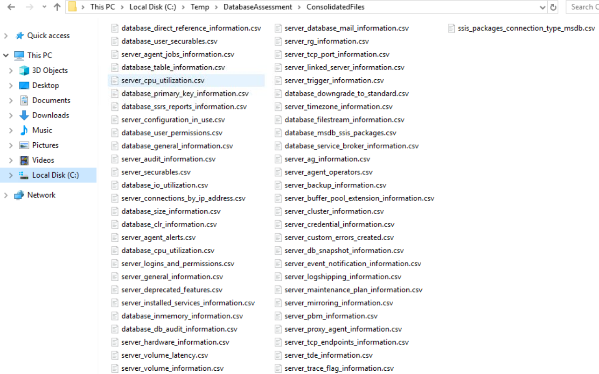

# ConsolidateFiles.ps1

## Description

The `ConsolidateFiles.ps1` script consolidates assessment CSV files from multiple SQL Server instances into single unified files. This step merges data from individual server assessments, preparing it for bulk loading into the assessment database.

## Prerequisites

- `DB_ASSESSMENT_HOME` environment variable must be set
- Assessment must have been run (run [`InvokeExecution.ps1`](InvokeExecution.md) first)
- Output folders must exist under `$Env:DB_ASSESSMENT_HOME\mssql-pre-database-assessment\`

## Environment Variables

| Variable | Required | Description |
|----------|----------|-------------|
| `DB_ASSESSMENT_HOME` | Yes | Root folder for the assessment toolkit |

## Usage

### Basic Usage

```powershell
.\ConsolidateFiles.ps1
```

### Full Workflow Example

```powershell
# Set environment variable
$Env:DB_ASSESSMENT_HOME = 'C:\DatabaseAssessment'

# Navigate to the assessment folder
cd $Env:DB_ASSESSMENT_HOME\DatabaseAssessment

# Run consolidation
.\ConsolidateFiles.ps1
```

## How It Works

1. **Locates Source Files**: Scans `$Env:DB_ASSESSMENT_HOME\mssql-pre-database-assessment\` for all CSV files in output folders
2. **Prepares Destination**: Creates or cleans the `ConsolidatedFiles` folder
3. **Merges Files**: Combines CSV files with the same name from different servers into single files
4. **Preserves Headers**: Maintains proper CSV structure with headers

### Source Structure (Before)

```
$Env:DB_ASSESSMENT_HOME\
└── mssql-pre-database-assessment\
    ├── output-SERVER001\
    │   ├── database_general_information.csv
    │   ├── server_hardware_information.csv
    │   └── ...
    ├── output-SERVER002\
    │   ├── database_general_information.csv
    │   ├── server_hardware_information.csv
    │   └── ...
    └── output-SERVER003-INSTANCE01\
        ├── database_general_information.csv
        ├── server_hardware_information.csv
        └── ...
```

### Destination Structure (After)

```
$Env:DB_ASSESSMENT_HOME\
└── ConsolidatedFiles\
    ├── database_general_information.csv  (data from all servers)
    ├── server_hardware_information.csv   (data from all servers)
    └── ...
```

## Output

### Console Output

```
C:\DatabaseAssessment
Starting the consolidation of files
Consolidation has been completed
Consolidation has been completed
...
```

### Consolidated Files

Each CSV file in the `ConsolidatedFiles` folder contains merged data from all assessed instances:



## Error Handling

| Scenario | Behavior |
|----------|----------|
| `DB_ASSESSMENT_HOME` not set | Throws error and exits |
| No output folders found | Processes zero files (no error) |
| CSV import failure | Logs error and continues with next file |

## Troubleshooting

| Issue | Solution |
|-------|----------|
| "DB_ASSESSMENT_HOME doesn't exist" | Set the environment variable before running |
| Empty `ConsolidatedFiles` folder | Verify `InvokeExecution.ps1` completed successfully |
| Missing data from some servers | Check individual output folders for errors |
| Duplicate rows | This is expected - each server contributes its own rows |

## Workflow Position

This script is **Step 2** in the assessment workflow:

```
┌─────────────────────┐     ┌─────────────────────┐     ┌─────────────────────┐
│  InvokeExecution.ps1│ --> │ ConsolidateFiles.ps1│ --> │  LoadDatabase.ps1   │
│  (Data Collection)  │     │  (Data Merging)     │     │  (Database Import)  │
└─────────────────────┘     └─────────────────────┘     └─────────────────────┘
```

## Notes

- The script uses semicolon (`;`) as the CSV delimiter for compatibility with European locales
- Files with the same name from different servers are appended to a single consolidated file
- The consolidation process does not validate CSV structure - ensure InvokeExecution.ps1 completed successfully
- No parameters are required - the script reads all configuration from the `DB_ASSESSMENT_HOME` environment variable

## Next Steps

After running `ConsolidateFiles.ps1`:

1. Verify the `ConsolidatedFiles` folder contains CSV files
2. Run [`LoadDatabase.ps1`](LoadDatabase.md) to import data into the assessment database
3. Generate reports using [`GenerateAppQuestionnaire.ps1`](GenerateAppQuestionnaire.md) or [`GenerateRDSSupport.ps1`](GenerateRDSSupport.md)
