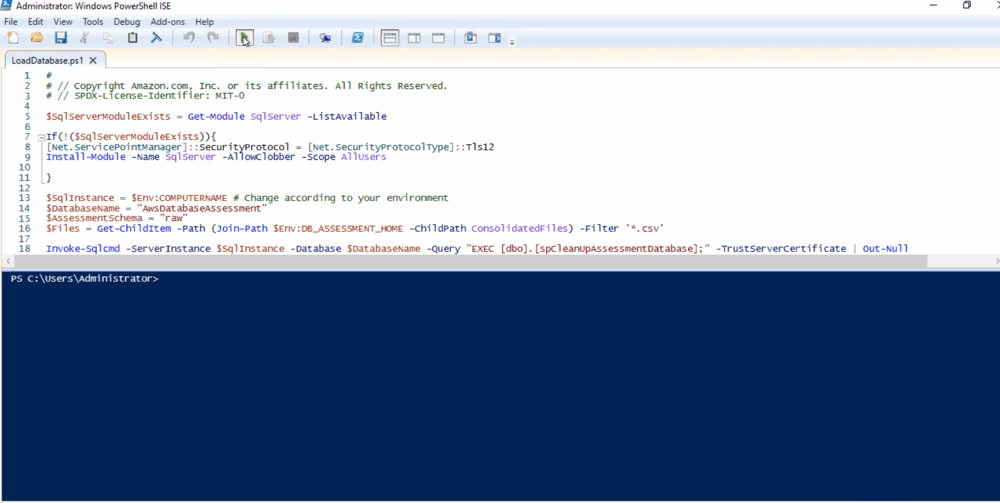

# LoadDatabase.ps1

## Description

The `LoadDatabase.ps1` script loads consolidated CSV assessment files into the `AwsDatabaseAssessment` database. It supports parallel processing for faster imports and automatically creates the database if it doesn't exist.

## Prerequisites

- `DB_ASSESSMENT_HOME` environment variable must be set
- `ConsolidatedFiles` folder must exist with CSV files (run `ConsolidateFiles.ps1` first)
- `SqlServer` PowerShell module (auto-installed if missing)
- Windows domain account with permissions to create databases or `db_owner` on existing database

## Parameters

| Parameter | Type | Required | Default | Description |
|-----------|------|----------|---------|-------------|
| `-SqlInstance` | string | No | `$Env:COMPUTERNAME` | SQL Server instance where the assessment database resides |
| `-DatabaseName` | string | No | `AwsDatabaseAssessment` | Name of the database to load data into |
| `-AssessmentSchema` | string | No | `raw` | Schema where raw assessment data is loaded |

## Usage

### Basic Usage (Local Server)

```powershell
# Uses defaults: local server, AwsDatabaseAssessment database, raw schema
.\LoadDatabase.ps1
```

### Specify SQL Server Instance

```powershell
.\LoadDatabase.ps1 -SqlInstance "SERVER01\SQLEXPRESS"
```

### Specify All Parameters

```powershell
.\LoadDatabase.ps1 -SqlInstance "SERVER01" -DatabaseName "MyAssessmentDB" -AssessmentSchema "staging"
```

### Full Workflow Example

```powershell
# Set environment variable
$Env:DB_ASSESSMENT_HOME = 'C:\DatabaseAssessment'

# Navigate to the assessment folder
cd $Env:DB_ASSESSMENT_HOME\DatabaseAssessment

# Run the data load (database will be created if it doesn't exist)
.\LoadDatabase.ps1 -SqlInstance "SQLSERVER01"
```

## Automatic Database Creation

If the target database doesn't exist, the script will:

1. Detect that the database is missing
2. Locate `AwsDatabaseAssessment.sql` in the same folder as the script
3. Execute the SQL script to create all database objects (tables, views, stored procedures, functions)
4. Continue with the data load

This eliminates the need to manually deploy the database schema before first use.

## Tables Loaded

Data is loaded into tables in the specified schema (default: `raw`):

- All `database_*` tables (CLR, CPU, I/O, general info, etc.)
- All `server_*` tables (backups, configuration, hardware, etc.)
- SSIS package information tables
- Other assessment data tables

## Stored Procedures Executed

The script runs these stored procedures if they exist:

| Procedure | Purpose |
|-----------|---------|
| `dbo.spCleanUpAssessmentDatabase` | Cleans up existing data before loading new data |
| `dbo.FixSSIS_packages_connection_type_ssisdb` | Fixes SSIS package names after import |

## Output

### Console Output Example

```
Checking if database 'AwsDatabaseAssessment' exists on 'SQLSERVER01'...
Database 'AwsDatabaseAssessment' already exists.
Checking for cleanup stored procedure...
Running spCleanUpAssessmentDatabase...
Starting job for importing the file: [database_clr_information.csv]
Starting job for importing the file: [database_cpu_utilization.csv]
...

Waiting for all import jobs to complete...
File database_clr_information.csv imported successfully! (15 rows)
File database_cpu_utilization.csv imported successfully! (42 rows)
...

Checking for SSIS fix stored procedure...
Running FixSSIS_packages_connection_type_ssisdb...
SSIS package names fixed successfully.

============================================
        LOAD DATABASE COMPLETE
============================================
Files found:      64
Files processed:  64
Target database:  AwsDatabaseAssessment on SQLSERVER01
```

### Processing Animation

The script uses parallel job processing, displaying progress as files are imported:



## Error Handling

| Scenario | Behavior |
|----------|----------|
| `DB_ASSESSMENT_HOME` not set | Throws error and exits |
| `ConsolidatedFiles` folder missing | Throws error and exits |
| No CSV files in folder | Throws error and exits |
| Database doesn't exist | Auto-creates using `AwsDatabaseAssessment.sql` |
| `AwsDatabaseAssessment.sql` missing | Throws error and exits |
| Import job fails | Logs warning, continues with other files |
| Stored procedure missing | Logs warning, continues |

## Troubleshooting

| Issue | Solution |
|-------|----------|
| "DB_ASSESSMENT_HOME doesn't exist" | Set the environment variable before running |
| "ConsolidatedFiles folder not found" | Run `ConsolidateFiles.ps1` first |
| "No CSV files found" | Ensure `ConsolidateFiles.ps1` completed successfully |
| "Database creation script not found" | Ensure `AwsDatabaseAssessment.sql` is in the DatabaseAssessment folder |
| Import failures | Check that table schemas match CSV column names |
| Connection failures | Verify network access and SQL Server permissions |

## Security Notes

- Uses TLS encryption (`-Encrypt Mandatory`) when supported by the SqlServer module
- Uses `TrustServerCertificate` for self-signed certificates in development environments
- Windows Integrated Authentication is used (no passwords in scripts)

## Next Steps

After running `LoadDatabase.ps1`:

1. Verify data loaded: Query tables in the `raw` schema
2. Generate reports using [`GenerateAppQuestionnaire.ps1`](GenerateAppQuestionnaire.md) or [`GenerateRDSSupport.ps1`](GenerateRDSSupport.md)
